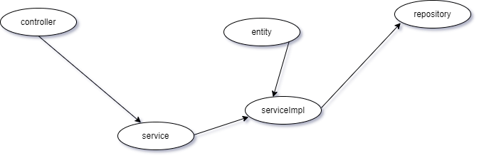

# Day 1


* Setup java 11  and Mysql
* [rest](#rest) 
* [XML](#xml)
* [SOA](#soa)
* [CRUD](#crud)


# REST
REpresentational State Transfer (REST) is a architectural style for providing standards
between computer systems. RESTful systems are characterized as State less and separate 
the concerns of client and server. The standard ways to communication of REST architecture
are as follows:

* Making requests
  * **HTTP** verb for kind of operation to be performed.
  * **HEADER** allows to pass along information about the request.
  * **PATH** a path to a resource.
  * an optional message containing data.
  
* HTTP verbs
  * **GET** : retrieve resource (by id) or collection of resources
  * **POST** : create new resource
  * **PUT** : update a specific resource
  * **DELETE**: remove a specific resource

### Header and accepted parameters
Client sends type of content to receive from server called as **Accept** field.
The options for types of content are **MIME** types (as `type/subtype` ).
Some of types and subtypes are as follows:
* `image`  - `image/png`, `image/jpeg`, `image/gif`
* `audio`  - `audio/wav`, `audio/mpeg`
* `video`  - `video/mp4`, `video/ogg`
* `application`  - `application/json`, `application/pdf`, `application/xml`, `application/octet-stream`


### Paths
Path of resource that operation should be performed.
e.g `GET localhost:8082/user/` often referred as route.
It may contain parameters such as `GET localhost:8082/user/1` where `1`
can be interpreted as `:id` e.g `GET localhost:8082/user/:id`


### Response
When sending payload data to client, the server must include `content-type` in 
the header of the response. `content-type` alerts the client for type of data to be sent.
Response code are sent if the operation is success or not from server to client.

<table>
<tr>
<td>code</td>
<td>Meaning</td>
</tr>
<tr>
<td>200 (OK)</td>
<td>success</td>
</tr>
<tr>
<td>201 (created)</td>
<td>item created</td>
</tr>
<tr>
<td>204 (No content)</td>
<td>nothing response</td>
</tr>
<tr>
<td>400 (BAD request)</td>
<td>bad request syntax, excessive size</td>
</tr>
<tr>
<td>403 (forbidden) </td>
<td>No permission to access resource</td>
</tr>
<tr>
<td>404 (Not found)</td>
<td>Resource can't be found</td>
</tr>
<tr>
<td>500 (Internal server error)</td>
<td>failure if No specific information available </td>
</tr>
</table>


# CRUD
`Crud` directory is basic implementation of crud in spring boot. I've implemented based on design patterns of building rest api for large scale cases.
It is made in  MVC (Model view controller) architecture.  MVC means as 
* Model : Contains core data of application (POJO).
* View  : responsible for rendering models data. (HTML/json/etc)
* Controller : Business logic of application.

Based on SOA (Service oriented architecture) , Its typical example of flow is as follows
* `entity`: POJO data
* `controller`: Routes paths
* `service`: Each entity service interfaces
* `service impl`: Implementation of each route, core business logic
* `repository` : ORM / native queries


API details of `crud` are as follows:

```
// For creating user entity
localhost:8082/user/create

```
```
// For read all users in list
localhost:8082/user/ 
```
```
// For update a  user, given id
localhost:8082/user/{id}
```
```
// For deleting a user, given id
localhost:8082/user/{id}
```
```
// For reading a user , given id
localhost:8082/user/{id}
```


# SOA

# XML
